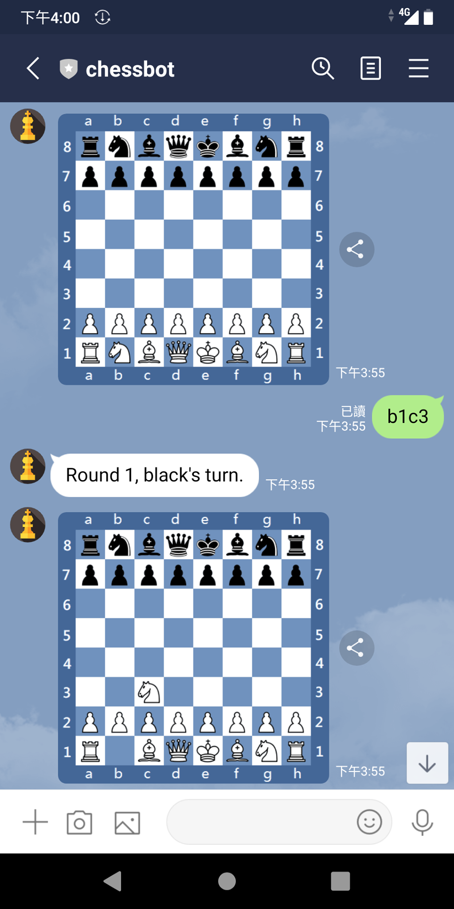
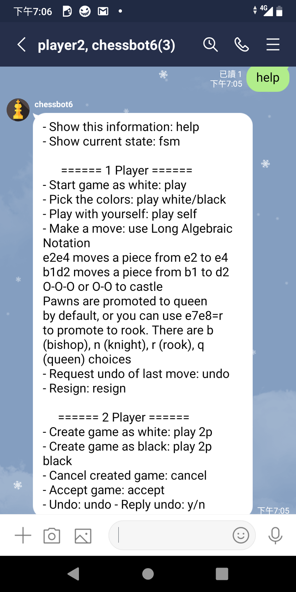
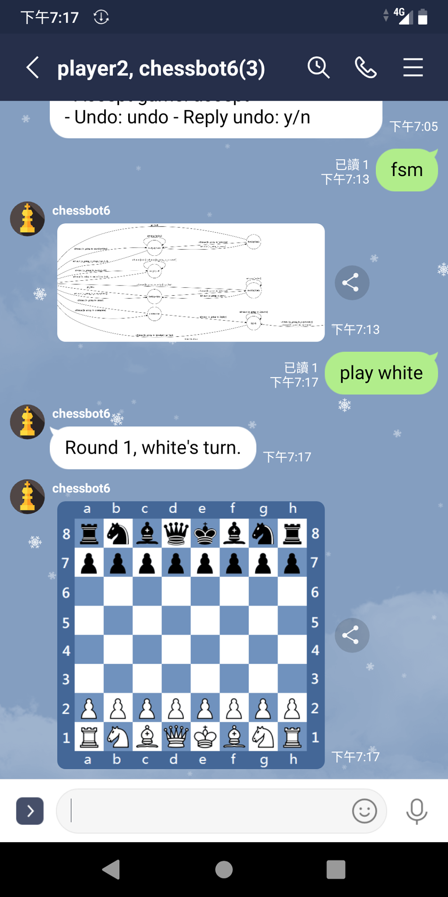
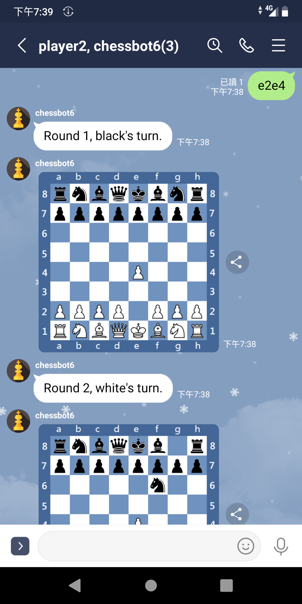
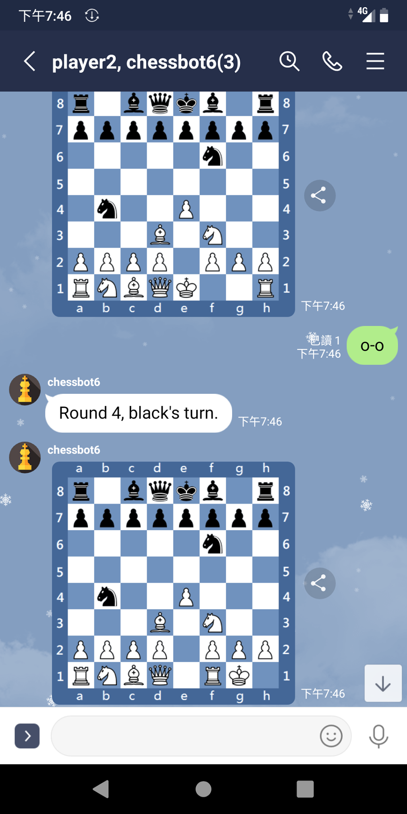
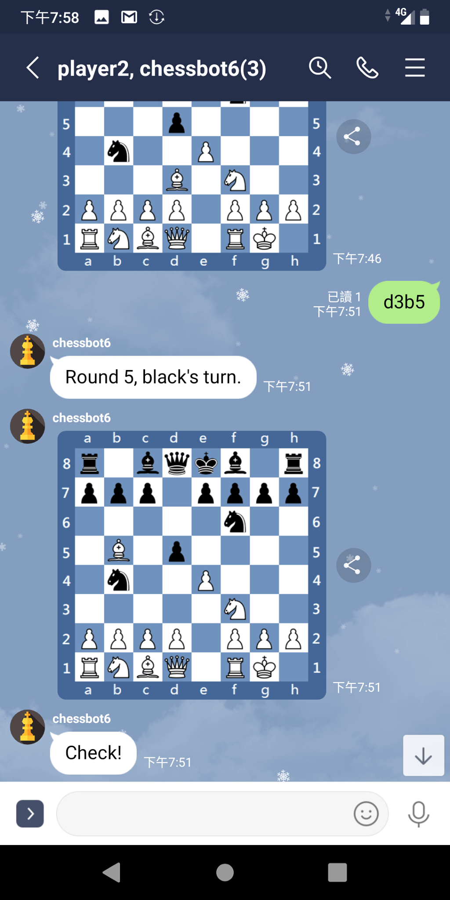
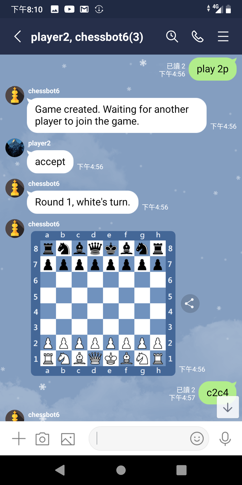
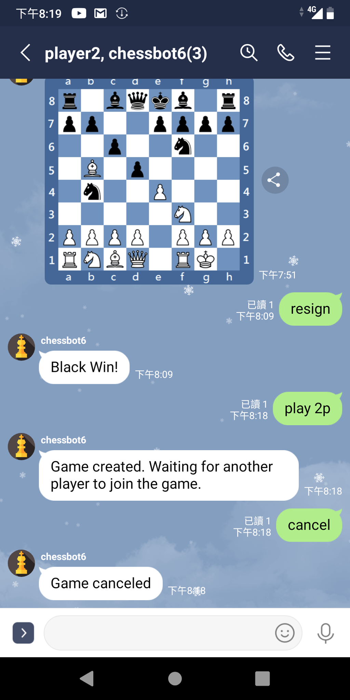
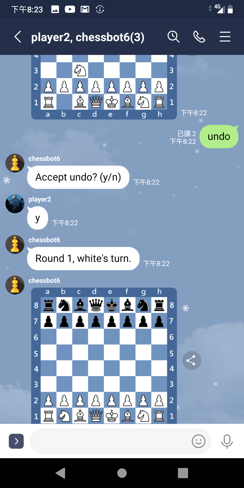

# Chessbot
Play chess with a line message bot and your friends! Inspired by [fbchess](https://www.facebook.com/fbchess/).



## FSM

A finite state machine that shows the operation flow of chessbot. Each position is specified as a **state**, and each move will trigger a **transition** that change the state of chessbot.

#### User Chat FSM


#### Room Chat FSM


## How to Build
#### Build on your ubuntu machine and test via [ngrok](https://ngrok.com/)
set up environment variables
```
$ ngrok http 8000
$ export LINE_CHANNEL_SECRET=         [your channel secret]
$ export LINE_CHANNEL_ACCESS_TOKEN=   [your channel access token]
$ export DOMAIN=                      [ngrok url]
$ export PORT=                        8000
```
install dependancies and run
```
$ sudo apt install graphviz libgraphviz-dev pkg-config
$ pip3 install -r requirements.txt
$ python src/app.py
```
use "[ngrok url]/callback" as **webhook settings** on your line bot messaging API panel

#### Build on [heroku](https://www.heroku.com)
```
$ heroku git:remote -a [your app name]
$ heroku buildpacks:set heroku/python
$ heroku buildpacks:add --index 1 heroku-community/apt
$ heroku config:set LINE_CHANNEL_SECRET=         [your channel secret]
$ heroku config:set LINE_CHANNEL_ACCESS_TOKEN=   [your channel access token]
$ heroku config:set DOMAIN=                      [heroku app url]
$ heroku config:set PORT=                        8000
$ git push heroku master
```

use "[heroku app url]/callback" as **webhook settings** on your line bot messaging API panel

## Play With AI

###### Type "help" to in chat room will show commands.



###### Tpye "play", "play white", "play black" to play with AI.



###### To move pieces, use [Long Algebaric Notation](https://en.wikipedia.org/wiki/Algebraic_notation_(chess)#Long_algebraic_notation) without using 'x' when you capture a piece. E.g., e2e4, g8f6.



###### Use "o-o" or "o-o-o" to castle



###### Pawns will be promoted to Queen after moving to side. If you want to promote a pawn to other piece type, use "=r" (Rook), "=n" (Knight), "=b" (Bishop), "=q" (Queen). E.g., "b7b8=r".

###### Checks are detected automatically.



###### Type "undo" to cancel AI's and your last move

###### Type "resign" to give up the game

## Play Yourself or With Friends

###### Type "play self" to move both white and black yourself.

###### Type "play 2p" or "play 2p black" to create a game. Afterwards, player2 type "accept" to join the game.



###### Type "play 2p" or "play 2p black" to create a game. Afterwards, type "cancel" to cancel a game



###### Type "undo" and player2 type "y" to cancel last move.



## Credit [ChessAI](https://github.com/Dirk94/ChessAI)
